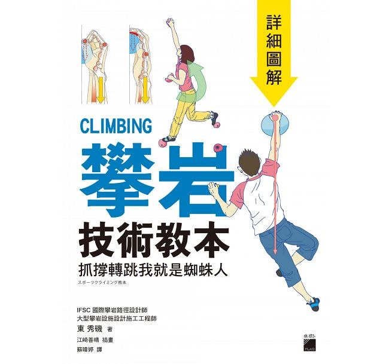

# 内容方针

## 中立的观点

**中立的观点**是编辑本书的基本规则之一，本书的索引及概括须以中立的观点书写，在尽可能没有偏见的前提下，平等地表达出任何曾在可靠来源中发表过的重要观点。本书不是严肃的百科全书，不要求完全的中立和精确性，但不允许收录含明显偏见或有悖事实的观点。

内容红线：

1. 广告或引流的内容。
2. 不实信息或没有可靠来源的信息。
3. 违反法律法规的内容。

### 例子

❌ 徒手攀岩 Free Solo (2018) - 亚历克斯·霍诺德(Alex Honnold) 徒手攀登酋长岩的故事，最好看的攀岩纪录片 / 你不得不看的攀岩纪录片 / 必看

✅ 徒手攀岩 Free Solo (2018) - 亚历克斯·霍诺德(Alex Honnold) 徒手攀登酋长岩的故事

## 紧凑的内容

**紧凑的内容**是编辑本书的基本规则之一，编辑和排版时需要保证内容紧凑和方便读者阅读。优先使用文字+超链接的形式概括和索引，在文字描述时不应过度的使用修饰词。若有必要使用图片或视频描述时，需保障页面内容紧凑，读者可以快速地找到需要的资源。

### 例子

❌ _**攀岩技术教本**_ | ISBN:9789863125228 - 有特别丰富的插图和原理解析，书中绘声绘色地讲解了技术背后的底层逻辑，非常适合攀岩新手阅读。 缺点：翻译质量一般。豆瓣链接：[https://book.douban.com/subject/30318177/](https://book.douban.com/subject/30318177/)

本书封面：

<figure><figcaption></figcaption></figure>

以上的内容主要问题：1. 使用修饰词稍多 2. 超链接单独展示 3. 图片尺寸过大

✅ _**攀岩技术教本**_ | ISBN:9789863125228 | [豆瓣9.5](https://book.douban.com/subject/30318177/) - 丰富的插图和原理解析，但翻译质量一般

<figure><figcaption></figcaption></figure>

如果认为图片没有必要也可以删除。

